# MRMPROBSチュートリアル  

最終更新日：2016/11/16  

## はじめに  
MRMPROBSは、多重反応モニタリング（multiple reaction monitoring; MRM）または選択反応モニタリング（selected reaction monitoring; SRM）だけでなく、SCANおよびデータに依存しないMS/MS取得データ（data independent acquisition; DIA）を使用した、ターゲットメタボロミクス解析の汎用プログラムとして開発されました。 当初、MRMPROBSプログラムは、1回の実行で500〜1000個の小分子を同時にモニタリングする大規模なMRMアッセイのデータセットを処理するために開発されました。このプログラムは、1）データキュレーション用の使いやすいグラフィカルユーザーインターフェイス（GUI）と、2）低分子同定の客観的評価システムを提供してきました。今回、DIA-MSデータ（SWATH-MSなど）およびSCANデータ（GC/MSやLC/MSなど）用に拡張されています。  
&emsp;&emsp;&emsp;&emsp;データのインポートから統計分析まで、すべてのデータ処理ワークフローがサポートされています。このチュートリアルでは、1）MRMデータ、2）SWATH-MS（DIA）データ、3）ターゲットメタボロミクスのGC/MSデータのワークフローを紹介します。このMRMPROBSプロジェクトでは、ユーザーインターフェイスだけでなく、同定および定量化システムを改善するためのあなたからのフィードバックを歓迎します。   

  
津川裕司 
理化学研究所　環境資源科学研究センター 
hiroshi.tsugawa@riken.jp

  
 

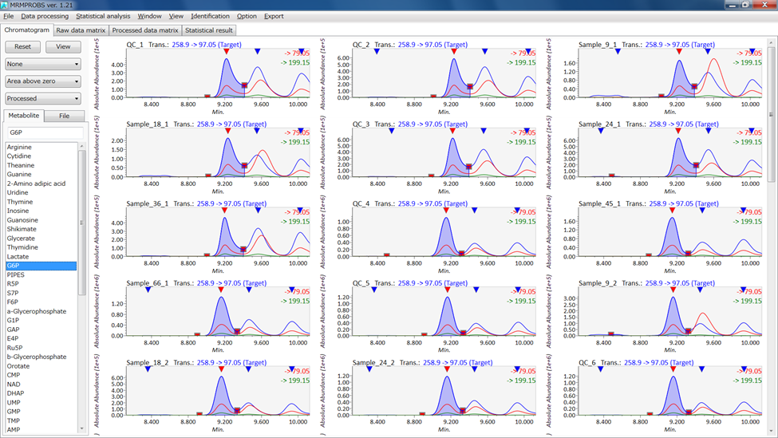  
MRMPROBSのスクリーンショット  
 

<h1 id="mrmprobsチュートリアル">MRMPROBSチュートリアル</h1>
<h2 id="table-of-contents">Table of contents</h2>

<a href="#セクション1">セクション1: ソフトウェアの環境</a> 
<a href="#セクション2">セクション2: 必要なソフトウェアとファイル</a> 
<a href="#セクション3">セクション3: プロジェクトのタイプと条件</a> 
<a href="#セクション4">セクション4: ABFファイルへの変換</a> 
&emsp;<a href="#セクション4-1">セクション4-1: ABFコンバーターのダウンロード</a> 
&emsp;<a href="#セクション4-2">セクション4-2: ファイル変換の条件の確認</a> 
&emsp;<a href="#セクション4-3">セクション4-3: ファイル変換</a> 
<a href="#セクション5">セクション5: リファレンスファイルのフォーマット</a> 
&emsp;<a href="#セクション5-1">セクション5-1: プロジェクトタイプ1のリファレンスライブラリ: MRMPROBS key index = metabolite name (abf)</a> 
&emsp;<a href="#セクション5-2">セクション5-2: プロジェクトタイプ2のリファレンスライブラリ: MRMPROBS key index = Function (mzML)</a> 
&emsp;<a href="#セクション5-3">セクション5-3: プロジェクトタイプ3のリファレンスライブラリ: MRMPROBS key index = SCAN or DIA-MS (abf)</a> 
&emsp;&emsp;<a href="#セクション5-3-1">セクション5-3-1: DIA-MSデータのためのリファレンスのフォーマット</a> 
&emsp;&emsp;<a href="#セクション5-3-2">セクション5-3-2: DIA-MSデータのためのディクショナリーファイル</a> 
&emsp;&emsp;<a href="#セクション5-3-3">セクション5-3-3: GC/MSとLC/MSデータのためのリファレンスのフォーマット</a> 
<a href="#セクション6">セクション6: MRMPROBSの実行</a> 
&emsp;<a href="#セクション6-1">セクション6-1: MRMデモ用データセットの概要</a> 
&emsp;<a href="#セクション6-2">セクション6-2: プロジェクトの立ち上げ</a> 
&emsp;<a href="#セクション6-3">セクション6-3: Abfファイルのインポート</a> 
&emsp;<a href="#セクション6-4">セクション6-4: パラメーター</a> 
<a href="#セクション7">セクション7: MRMPROBSのビューア</a> 
&emsp;<a href="#セクション7-1">セクション7-1: クロマトグラムのビューアでのマウス操作</a> 
&emsp;<a href="#セクション7-2">セクション7-2: Libraryの編集 (オプション)</a> 
&emsp;<a href="#セクション7-3">セクション7-3: ツールボタン</a> 
&emsp;<a href="#セクション7-4">セクション7-4: タブ</a> 
&emsp;<a href="#セクション7-5">セクション7-5: ボタン</a> 
&emsp;<a href="#セクション7-6">セクション7-6: リストボックス</a> 
&emsp;<a href="#セクション7-7">セクション7-7: MRMPROBSで行う解析について</a> 
&emsp;&emsp;<a href="セクション7-7-1">セクション7-7-1: Fileメニュー</a> 
&emsp;&emsp;<a href="#セクション7-7-2">セクション7-7-2: Data reprocessing</a> 
&emsp;&emsp;<a href="#セクション7-7-3">セクション7-7-3: Statistical analysis</a> 
&emsp;&emsp;<a href="#セクション7-7-4">セクション7-7-4: Missing value methods</a> 
&emsp;&emsp;<a href="#セクション7-7-5">セクション7-7-5: Normalization</a> 
&emsp;&emsp;<a href="#セクション7-7-6">セクション7-7-6: Windowメニュー</a> 
&emsp;&emsp;<a href="#セクション7-7-7">セクション7-7-7: Viewメニュー</a> 
&emsp;&emsp;<a href="#セクション7-7-8">セクション7-7-8: Optionメニュー</a> 
&emsp;&emsp;<a href="#セクション7-7-9">セクション7-7-9: Exportメニュー</a> 
<a href="#付録a">付録A: 島津の.lcdファイルの適切なファイル変換方法</a> 
<a href="#付録b">付録B: MRMPROBSの３番目のオプション: mzMLファイルの解析</a>

 

## セクション1   
## ソフトウェアの環境  
* Microsoft Windows 7以降  
* .NET Framework 4.0以降  

## セクション2   
## 必要なソフトウェアとファイル  
* Reifycs Analysis Base File Converter (ABF file converter)  
ダウンロード先: <http://www.reifycs.com/AbfConverter/index.html>  

* MRMPROBS  
ダウロード先: <http://prime.psc.riken.jp/Metabolomics_Software/MRMPROBS/index.html>  

* デモ用のファイルとリファレンスライブラリ（タブ区切りテキストファイル）  
例: <http://prime.psc.riken.jp/Metabolomics_Software/MRMPROBS/index.html>  

MRMPROBSは、Analysis Base Framework（ABF）形式のデータをインポートできます。MRMPROBSは、ターゲット代謝物の名前、保持時間、振幅情報、プリカーサー *m/z* およびプロダクト *m/z* を含むリファレンスライブラリを元にクロマトグラムデータを抽出します。ABF変換でサポートされている形式は、島津製作所（.LCD）、Agilent Technologies（.D）、AB Sciex（.WIFF）、Waters（.RAW）、およびThermo Fisher Scientific（.RAW）です。MRMPROBSは、オープンソースのファイルトランスレータであるProteoWizardによって変換された一般的なデータ形式の.mzMLもサポートしています。詳しい情報は **付録B** で説明しています。   

## セクション3   
## プロジェクトのタイプと条件  

    

1\. MRMPROBS key index = metabolite name (abf)
 * MRMメソッド設定で化合物名に半角英数字記号を使用します。  
 * 異なるトランジション（プリカーサー：プロダクト）セットで同じ化合物名を使用しないでください。  

2\. MRMPROBS key index = Function (mzML)  
 * "Function ID"がクロマトグラムデータの抽出に使用されます。ユーザーは、通常のライブラリ形式に加えて、"function id"情報をライブラリに追加する必要があります。(付録Bを参照)  

&#042; 上記の2つのプロジェクトは、MRMデータセット用です。  

3\. MRMPROBS key index = SCAN or DIA-MS (abf)  
 * MRMPROBSは、GC/MS、LC/MS、およびLC-DIA-MS（SWATHなど）データセットをインポートできます。  
 * 特定の保持時間範囲と *m/z* 値を抽出するために、リファレンスライブラリを準備します（付録Cを参照）。  
 * 化合物の名前には半角英数字記号を使用します。  

4\. MRM-DIFF (abf, mzML)  
右サイト参照 <http://prime.psc.riken.jp/Metabolomics_Software/MRMPROBS/index.html>.  

## セクション4
## ABFファイルへの変換  
### セクション4-1
### ABFコンバーターのダウンロード  
1. 右サイトへ行く <http://www.reifycs.com/AbfConverter/index.html>.  
2. 要件とライセンス条項を確認し、コンバーターをダウンロードします。  

&#042; ファイルコンバーターはフリーソフトです。  

   

### セクション4-2
### ファイル変換の条件の確認  
Bruker、LECO、Shimadzu、Thermo、Watersなどの一部のMSベンダーのファイルを変換するには、特定のデータアクセスライブラリをPCにインストールする必要があります。  

ABFコンバーターに関するFAQも参照して下さい。  
<http://prime.psc.riken.jp/Metabolomics_Software/MS-DIAL/index3.html>  

**ファイル変換の要件**

|ベンダー|フォーマット|要件|  
|:-:|:-:|:-:|
|Agilent|.D|なし。ただし、ChemstationのファイルはnetCDFに変換する必要があります。|  
|Bruker|.D|CompassXtract|  
|LECO|.PEG|All PEG files should be first converted to netCDF (AIA).|  
|Sciex|.WIFF|なし|   
|Shimadzu for GC/MS|.QGD|GCMS solution|  
|Shimadzu for LC/MS|.LCD|LCMS solutions|  
|Thermo|.RAW|MSFileReader|  
|Waters|.RAW|MassLynx Raw Data Reader Interface Library|  
|netCDF|.CDF|Microsoft Visual J# 2.0|  

**FAQ**  
* Agilent: Agilentのほとんどすべての生データ（.D）は、追加の手順なしで簡単に変換できます。ただし、唯一の例外はChemStationから取得したGCMSデータセットであり、ABFに直接変換することはできません。まず、ChemStationでファイルをnetCDF（AIA）に変換してから、AIAファイルをABFに変換します。  
* Bruker: 右サイトに行ってください<https://www.bruker.com/service/support-upgrades/software-downloads/mass-spectrometry.html>。最初に登録して、インストーラーを入手する必要があります。オペレーティングシステム環境と互換性のあるバージョン（32ビットまたは64ビット）をダウンロードしてインストールします。  
* LECO: すべてのデータを最初にnetCDF（AIA）に変換する必要があります。その後に、ファイルコンバーターを使用してABFに変換します。  
* Shimadzu: .lcdファイルの化合物の表には、MRM条件（.lcmファイル）を含める必要があります。これを設定する方法は、**付録A** で説明しています。生データを直接変換した場合は、データを一般的なデータ形式（netCDFまたはmzML）に変換してください。GC/MSの場合、GCMSソリューションを使用してデータをnetCDFに変換します。LC-ITTOF/MSの場合、ProteoWizard（<http://proteowizard.sourceforge.net/index.shtml>）を使用してデータをmzMLに変換してから、ABFに変換します。   
* Thermo: 次のリンクは、MSFileReaderのインストール方法を説明しています。<http://fields.scripps.edu/rawconv/>。 GC/MSデータの場合、データをnetCDFに変換してからABFに変換する必要があります。GC-QExactive生データからABFへの直接変換を検証しましたが、一部のGC/MSデータ（DSQなど）はまずnetCDFに変換する必要がありました。  
* Waters: まず、MassLyncs Raw Data Reader Interface Libraryをダウンロードします (<a href="http://www.waters.com/waters/supportList.htm?cid=511442&filter=documenttype|DWNL&locale=en_US">http://www.waters.com/waters/supportList.htm?cid=511442&filter=documenttype|DWNL&locale=en_US</a>)。次に、アーカイブファイル"watersrawsdkredist.zip"を解凍し、"MassLynxRaw.dll"（64ビット）をABFコンバーターの"ABFCvtSvrWtrRw"フォルダーにコピーします。ファイル変換では、32ビット環境はまだサポートされていないことに注意してください。   
* NetCDF: J＃依存関係の問題に関するエラーが表示されたら、以下のサイトからMicrosoft Visual J＃2.0ライブラリをダウンロードしてインストールします。 <https://www.microsoft.com/en-us/download/details.aspx?id=15468>   

 

### セクション4-3
### ファイル変換  
1. "AnalysisBaseFileConverter.exe"を実行します   
2. このプログラムに、ベンダーのファイルをドラッグ＆ドロップします  
3. "Convert"をクリック  
4. 生データファイルと同じフォルダにABFファイルが生成されます  

## セクション5
## リファレンスファイルのフォーマット  
### セクション5-1
### プロジェクトタイプ1のリファレンスライブラリ: MRMPROBS key index = metabolite name (abf)  
タブ区切り形式として5つの項目が必要です。ヘッダー名は任意ですが、項目の順序は保持する必要があります。   

  

1列目.&emsp;&emsp;&emsp;&emsp;化合物名a  
2列目.&emsp;&emsp;&emsp;&emsp;プリカーサー *m/z* (精密質量は概数で示します)  
3列目.&emsp;&emsp;&emsp;&emsp;プロダクト *m/z*  
4列目.&emsp;&emsp;&emsp;&emsp;保持時間（分）   
5列目.&emsp;&emsp;&emsp;&emsp;Amplitude ratios [%]b  

注意  
a MRMPROBSのプロジェクト1を選択する場合、化合物名は機器の設定ウィンドウの化合物名と同一である必要があります。化合物名は、半角英数字記号で記述する必要があります。  

bamplitude ratioのフォーマットについて  
* "100"は、標的化合物の定量イオンとして認識され、他の値は、標的化合物の同定のためのイオンとして認識されます。  
* 定量イオンは各化合物ごとに設定する必要があり、現在のプログラムでは1つの化合物に対して複数の定量イオンを設定できません。つまり、"100"は1回しか使用できません。以下は、リファレンスレコードの例です。  

&#10003; 例: １つの代謝物に対し1つのトランジション  
&emsp;&emsp;Thymine&emsp;&emsp;125&emsp;	42.05&emsp;	5.58&emsp;	100  

&#10003; 例: １つの代謝物に対し複数のトランジション  
&emsp;&emsp;G6P&emsp;&emsp;258.9&emsp;	97.05&emsp;	9.21&emsp;	100  
&emsp;&emsp;G6P&emsp;&emsp;258.9&emsp;	79.05&emsp;	9.21&emsp;	30.1  
&emsp;&emsp;G6P&emsp;&emsp;258.9&emsp;199.15&emsp;	9.21&emsp;	5.5  

* 繰り返しになりますが、MRMPROBSはトータルイオンクロマトグラムによって代謝物を定量化しません。 代わりに、1つの定量トランジションがピークの定量化に使用されます（これを"ターゲット"トランジションと呼びます）。  
* クォリファイアートランジション（またはコンフォメーショントランジション）の振幅として、100に対する比率[％]を入力します。この情報は、ピークの識別に使用されます（"クォリファイアー"トランジションと呼びます）。  

***注意 1:*** MRMPROBSでは、リファレンスライブラリを編集して、その情報を更新できます。ただし、空欄の項目があると、ライブラリのインポートができません。代謝物の適切な保持時間と振幅情報がわからない場合は、任意の値を入力します。   

***Note 2:*** MS機器に入力したすべての代謝物情報を含める必要はありません。   

***Note 3:*** Microsoft Excelからエクスポートされたタブ区切りファイルには、予期しない非表示の後続列が含まれることがあります。"Ratio"列の後に予期しない列が入ってしまうと、MRMPROBSで処理できません。複数行を選択することにより、エクスポートされたファイルを検査できます（以下を参照）。 最後の列（"Ratio"）の後に選択されている部分がある場合、Excelでファイルを編集してこれらの列を削除し、再度エクスポートします。

良い例 (非表示の後続列が含まれていない)  
  

悪い例 (非表示の後続列が含まれている)  
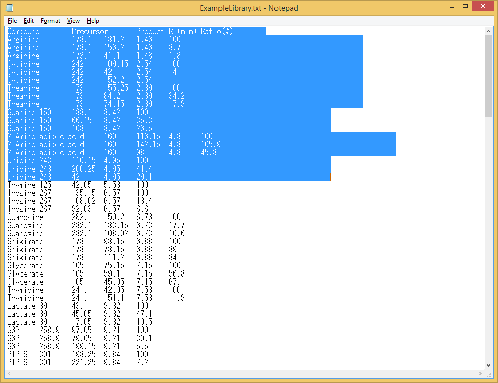  

### セクション5-2
### プロジェクトタイプ2のリファレンスライブラリ: MRMPROBS key index = Function (mzML)  
タブ区切りのテキスト形式として6つの項目が必要です。ヘッダー名は任意ですが、項目の順序は保持する必要があります。（ここでは、ライブラリを簡単に確認できるように、Microsoft Excelで説明しています。）  

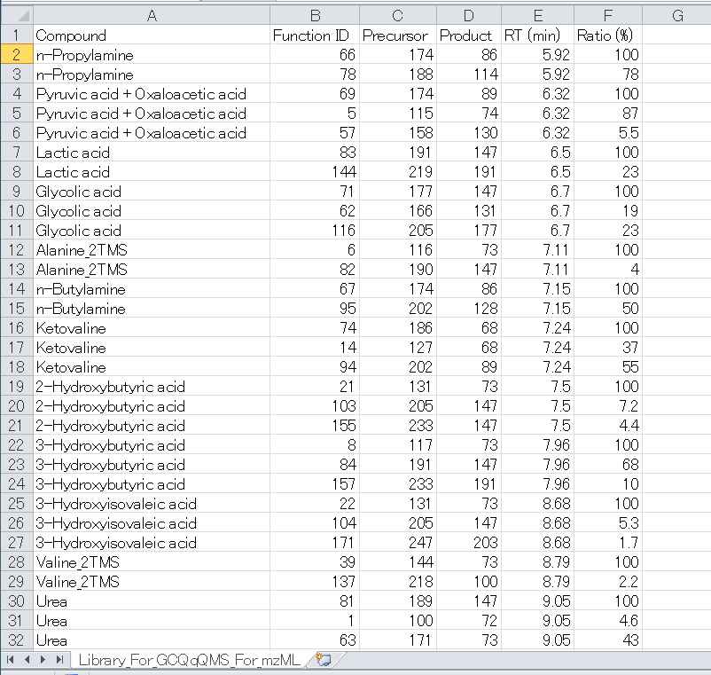

1列目.&emsp;&emsp;&emsp;&emsp;Compound namea  
2列目.&emsp;&emsp;&emsp;&emsp;Function IDb  
3列目.&emsp;&emsp;&emsp;&emsp;Precursor *m/z* (accurate *m/z* information is rounded into nominal *m/z* information)  
4列目.&emsp;&emsp;&emsp;&emsp;Product *m/z*  
5列目.&emsp;&emsp;&emsp;&emsp;Retention time [min]  
6列目.&emsp;&emsp;&emsp;&emsp;Amplitude ratios [%]c  

Notes  
a MRMPROBSのプロジェクト2を使用する場合、"Compound name"は機器で設定される化合物名と同じである必要はありません。名前は、半角英数字で記述して下さい。  

b "function ID"は、このオプションを使用するための最も重要なIDです。mzMLデータには、特定のMRMクロマトグラム（保持時間の範囲、プリカーサーイオン、プロダクトイオン）にアクセスするための明確なキーである"function ID"を示すマークアップがあります。"function ID"とMRM情報の関係を簡単に確認するには、ProteoWizard WebページからダウンロードできるSeeMSプログラムを使って下さい。: <http://proteowizard.sourceforge.net/>  
1. SeeMSを実行  
2. mzMLファイルを一つ選択する。  

  

データ内で同じ"function ID"を見つけるには、 Microsoft Excelの並べ替え関数と実験条件ファイルを使用します。 ほとんどの場合、proteowizardは、1. Precursor Ion、2. Product Ion、3. 保持時間の開始点の順序でソートしています。  

c "amplitude ratio"のフォーマットについては、セクション5-1を参照して下さい。  

### セクション5-3
### プロジェクトタイプ3のリファレンスライブラリ: MRMPROBS key index = SCAN or DIA-MS (abf)  
#### セクション5-3-1
#### DIA-MSデータのためのリファレンスのフォーマット  
MRMPROBSソフトウェアは、GC/MS、LC/MS、LCデータ非依存MS/MS（DIA-MS）などのスキャンタイプのデータを解析できます。次の図は、DIA-MSデータのリファレンスライブラリです。ここでの目的は、DIA-MSデータをMRM（DIA-MRMと呼ばれるもの、たとえばSCIEXマシンのSWATH-MRMなど）として利用することです。このライブラリはMS-DIALソフトウェアを使って簡単にエクスポートできます。: <http://prime.psc.riken.jp/Metabolomics_Software/MS-DIAL/>  

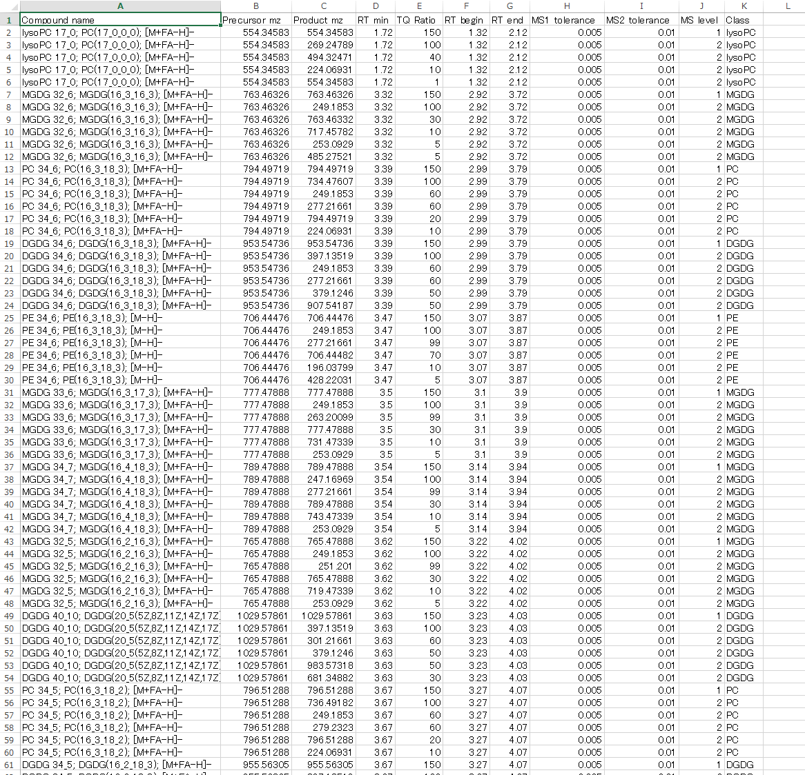

1列目.&emsp;&emsp;&emsp;&emsp;Compound name  
2列目.&emsp;&emsp;&emsp;&emsp;Precursor *m/z*  
3列目.&emsp;&emsp;&emsp;&emsp;Product *m/z*  
4列目.&emsp;&emsp;&emsp;&emsp;Retention time [min]  
5列目.&emsp;&emsp;&emsp;&emsp;Amplitude ratios [%]  
6列目.&emsp;&emsp;&emsp;&emsp;RT begin: クロマトグラムの開始時間  
7列目.&emsp;&emsp;&emsp;&emsp;RT end: クロマトグラムの終了時間  
8列目.&emsp;&emsp;&emsp;&emsp;MS1 tolerance: MSデータのサーベイスキャンのための質量精度  
9列目&emsp;&emsp;&emsp;&emsp;MS2 tolerance: MS/MSスペクトルのための質量精度  
10列目.&emsp;&emsp;&emsp;&nbsp;MS level: MSデータ(MS1)のサーベイスキャンなら"1"、MS/MSなら"2"となる  
11列目.&emsp;&emsp;&emsp;&nbsp;Class: MRMPROBSビューアでクロマトグラムにフィルターをかける時に必要です。必要ない場合は"NA"などと設定して下さい。  

**下図は、MS-DIALからMRMPROBSへの橋渡しについての説明です**  

#### セクション5-3-2
#### DIA-MSデータのためのディクショナリーファイル  
ディクショナリーファイルには、MS1のスキャンレンジと、プリカーサーウィンドウを実験IDとともに含める必要があります。

SWATH（データ非依存）分析の場合、PeakViewで実験ファイルを作成できます（Show-> sample information）。列の順序を変更しないでください。"SCAN"という単語を保持する必要があります。  

#### セクション5-3-3
### GC/MSとLC/MSデータのためのリファレンスのフォーマット  
MRMPROBSは、GC/MSやLC/MSなどの単一のMSデータを使用できるように改善されています。下の図は、GC/MSデータのリファレンスライブラリを示しています。単一のMSデータセットをインポートするコツは、1）"Product *m/z*" と"Precursor *m/z*" に同じ値を、また"MS1 tolerance"と"MS2 tolerance"に同じ値を割り当てること、2）"MS level"として"1"を割り当てることです。
このライブラリはMS-DIALソフトウェアで簡単にエクスポートできます。
: <http://prime.psc.riken.jp/Metabolomics_Software/MS-DIAL/>  

## セクション6
## MRMPROBSの実行  
### セクション6-1
### MRMデモ用データセットの概要  
1. プロジェクトを立ち上げる  
2. Abfファイルをインポート  
3. パラメーターの設定  
4. ソフトウェアの実行 (1-2分/サンプル)  

&#042; チュートリアルでは、下記のリンクからダウンロード可能な40のデモファイルとリファレンスライブラリを使用しています。デモンストレーションファイルの共通の測定条件は次のとおりです。   

液体クロマトグラム: 各サンプル計25分のラン、CELI L-column2 ODC (150 mm×2.1 mm, 3 μm)を使用。  
質量分析: MRM法を用いたネガティブイオンモード  
ターゲット代謝物数: 60  
トランジションの総計: 166  

実験条件の詳細は、下記MRMデータベースからダウンロードできます(Ion-pair LC-QqQ/MS)。  

<http://prime.psc.riken.jp/Metabolomics_Software/MrmDatabase/index.html>  

### セクション6-2
### プロジェクトの立ち上げ  

1. File &rarr; New project.  

2. "project type"を選択 (このデモでは一番上のプロジェクトを選択する).  

### セクション6-3
### Abfファイルのインポート  
  

注意:
* バッチ実験ごとにプロジェクトフォルダを作成することをお勧めします。MRMPROBSプロジェクトでは、2つのフォルダー（raw, processed）および1つのファイル（&#042;.mth）が生成されます。これらは同じディレクトリに含める必要があります。  
* ファイル名は半角英数字記号で入力する必要があります。  
* "Sample"、"Standard"、"Blank"、および"QC"から各ファイルのファイルタイプを選択します。"QC"は、LOESSベースの正規化に必要です。  
* "Class ID"は色ラベルに使用されます。   
* "Analytical order"と"class ID"は、データ処理後でも変更できます。  

### セクション6-4
### パラメーター  
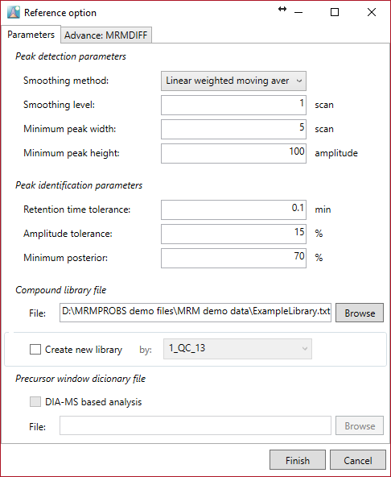  

このデモでは、"ExampleLibrary.txt"を選択して、上記のようにパラメーターを設定して下さい。  

***注意:***  
* リファレンスライブラリ内の代謝物の保持時間と振幅を、QCや混合標準品などのサンプルファイルから編集または更新したい場合は、"create new library"をチェックして、参照するファイル名を選択します。このデモンストレーションでは、"20_STD10uM_02"が選択されています。  

**[推奨するパラメーター設定]**  
*Peak detection*  
Smoothing method: linear weighted moving average  
Smoothing level: 1-2  
Minimum peak width: 3-5  
Minimum peak height: 50-100  

*Peak identification*  
Retention time tolerance: 逆相または親水性相互作用液体クロマトグラフィーを使用した場合、0.1〜0.2分が推奨されます。  
Amplitude tolerance: 15  
Minimum posterior: ピーク同定の最小確率を決定します。MRMPROBSは、ピークの確率、つまり「計算されたスコアが与えられた真の標的代謝物の確率」を計算します。この基準値未満で検出されたピークは、偽のピークとして認識されます。推奨値は50〜70です。  

Note: The first data processing including file import, peak detection, and peak identification requires 5-20 seconds (depending on machine specifications) per file.  

## セクション7
## MRMPROBSのビューア  
### セクション7-1
### クロマトグラムのビューアでのマウス操作  
メイン・ウィンドウ  

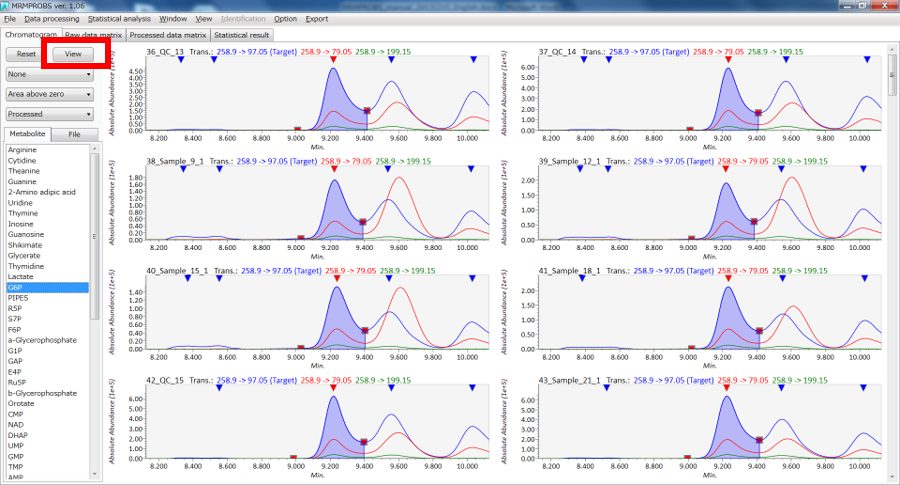  

  

*Viewモード*  
1. クロマトグラムのウィンドウ: 左クリックしながらドラッグ &rarr; クロマトグラムのスクロール、右クリックしながらドラッグ &rarr; クロマトグラムのズーム  
2. ウィンドウの上部: 逆三角形を左ダブルクリック &rarr; 検出するピークを変えます、任意の場所で右ダブルクリック &rarr; 検出したピークを解除します  
3. ウィンドウの下部（保持時間）: 右クリックしながらドラッグ &rarr; 保持時間の範囲を変えます  
4. ウィンドウの左部（強度）: 右クリックしながらドラッグ &rarr; 強度の範囲を変えます  

*Editモード*
1. ピークの端（赤い四角）を左クリックでドラッグ &rarr; ピークの端を変えます  
2. 右クリックでドラッグ &rarr; 新しいピークを検出します  

### セクション7-2
### Libraryの編集 (オプション)  
  
* QCサンプルファイルまたは混合標準品ファイルを使用して、各代謝物の保持時間と振幅比を更新できます。ピーク定量化に必要なターゲットトランジションを変更することもできます。  
* デフォルトでは、EICクロマトグラムの最も高いピークに基づいて同定しています。真のピークを変更する必要がある場合は、逆三角形をダブルクリックします。  
* ターゲットトランジションを変更する場合は、"Target MRM"コンボボックスからターゲットとなるMRMトランジションを選択します。  
* 右列の情報（化合物名、ターゲットMRM、RT、および振幅比）は、左側のリストボックスで化合物名をダブルクリックするか、EICクロマトグラムヴューアで真のピークを再選択することにより生成されます。  
* 目的の代謝物が検出されていない場合は、左上の"View"ボタンをクリックして"Edit"モードに切り替えます。"Edit"モードで、右クリックしながら検出したいピーク領域をマウスでドラッグします。  
* 保持時間または振幅情報を手動で変更する場合は、テキストボックスに必要な情報を入力して、右上の"Update"ボタンをクリックします。  
* 更新されたライブラリを保存する場合は、左上の"Save"ボタンをクリックします。  
* 最後に、リファレンスライブラリを編集した後、左上の"Finish"ボタンをクリックします。  

注意: クロマトグラム・ヴューアの詳細と操作方法については後述します  

### セクション7-3
### ツールボタン  

* File: 新しいプロジェクトを開始する、既存のプロジェクトを開く、プロジェクトとして保存する、プロジェクトを保存する  
* Data processing: ファイルごと、化合物ごと、あるいはすべてのデータセットに対してデータ再処理を行う  
* Statistical analysis: データの正規化と統計解析  
* Window: クロマトグラム・ヴューアのタイル設定  
* View: クロマトグラム・ビューアの並べ替え  
* Option: クラスIDと分析の順序を再定義し、内部標準を選択し、統計分析のデータを「含める」または「除外する」を決定します  
* Identification: MRMPROBSのプロジェクトでは必要ない  
* Export: 結果は、タブ区切りテキスト形式でエクスポートされます  
* Help: バージョン情報の確認  

### セクション7-4
### タブ  

* Chromatogram: すべてのデータ操作タスクはここで実行されます  
* Raw data matrix: 各ファイルおよび各化合物のピーク定量化値はここに示されます  
* Processed data matrix: 各ファイルと各化合物の正規化された値はここに示されます  
* Statistical result: 統計解析の結果はここに示されます  

Raw data matrix  
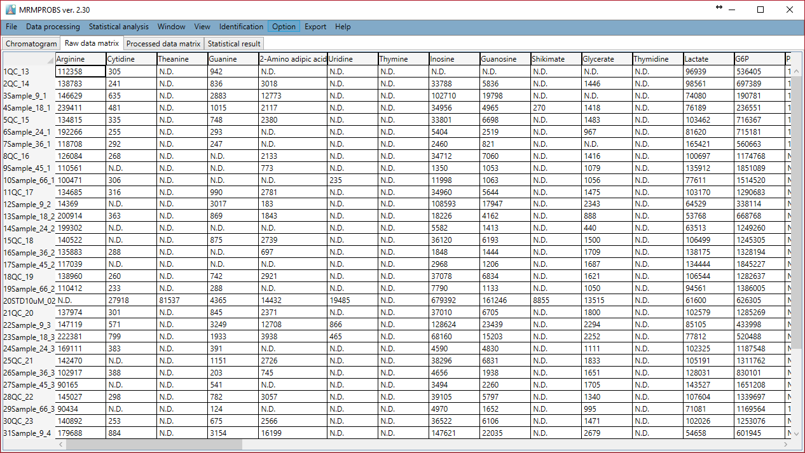

### セクション7-5
### ボタン  

* Reset: クロマトグラムの表示範囲をリセットします  
* View: この"View"ボタンを押すと、クロマトグラムヴューアが"Edit"モードに変わります。"Edit"モードでは、ピークの端を変更し、新しいピークを手動で検出できます。  
* None: 検出されたピークのプロパティは、このコンボボックスに表示されます。クロマトグラム・ビューアで合計スコア（確率）、保持時間の類似度、面積、リファレンスの保持時間を確認できます。  
* Height: 定量化のモードを設定できます。デフォルトは、ピークの高さに設定されます。面積モードに変更できます。"All"オプションを使用すると、定量化のモードがすべてのファイルとすべての代謝物に適用されます。  
* Processed: 生のクロマトグラムと平滑化されたクロマトグラムを見ることができます。  

### セクション7-6
### リストボックス  
  

代謝物名またはファイル名をダブルクリックすると、クロマトグラム・ビューアにクロマトグラムが生成されます。  

### セクション7-7
### MRMPROBSで行う解析について  
#### セクション7-7-1
#### Fileメニュー  
* New project: 新しいプロジェクトの立ち上げ  
* Open project: すでにあるプロジェクトを開く。&#042;.mthファイル、生データのフォルダ、処理データのフォルダは同じディレクトリになければいけません  
* Save as: 新しいファイルとして保存  
* Save: すでにあるプロジェクトを上書き保存  

#### セクション7-7-2
#### Data reprocessing  
データの再処理は、このオプションで新しく最適化されたパラメーターによって実行できます。再処理は、代謝物ごとまたはファイルごとにも実行できます。ターゲットMRMも変更できます。パラメータは、代謝物ごとおよびファイルごとに設定できます。ファイルのインポートはすでに実行されているため、データの再処理に必要な時間は非常に短いです。  

  

#### セクション7-7-3
#### Statistical analysis  
現在のプログラムでは、2種類の"missing value approach"を適用できます。また、内部標準、および解析オーダー情報を使用したlowess/cubic splineによって定量化した値を正規化できます。 内部標準を使用する場合は、"Option"メニューで最適な設定をする必要があります。現在のプログラムは、主成分分析も実行できます。  

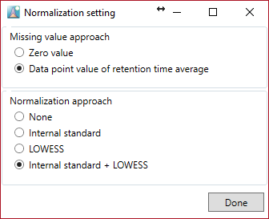  

#### セクション7-7-4
#### Missing value methods  
* Zero value: このオプションは、生データマトリックスの"N.D."にゼロ（0）を与えます。  
* Data point value of retention time average: このオプションは、生データマトリックスの"N.D."に対して以下で説明する値を与えます。  

1. このプロセスは、列ごと、つまり代謝物ごとに実行されます。  
2. 代謝物の値がすべてのファイルで"N.D."である場合、ゼロ（0）が割り当てられます。  
3. "N.D."ファイル以外の保持時間の値が保存され、平均値が計算されます。  
4. "N.D."ごとに、処理されたEICクロマトグラム（平滑化後）の平均保持時間と"data point"の一貫性の強度が定量値として割り当てられます。  

#### セクション7-7-5
#### Normalization  
* None: "missing value approach"の実行後、生データ行列の値は処理済みデータマトリックスに保存されます。  
* Internal standard: "missing value approach"の実行後、"Option"メニューで設定された内部標準値で割った値が、処理済みデータマトリックスに保存されます。  
* LOESS: "missing value approach"の実行後、各代謝物のシグナル強度は、lowess/cubic spline法によってQCサンプル情報で正規化されます。  
* Internal standard + LOESS: 内部標準を使った正規化が実行された後に、lowess/cubic spline法による正規化が実行されます。  

"Done"ボタンをクリックした後に、"Statistical analysis setting"が設定できます。  
  

主成分分析を行うことができます。計算される主成分数を設定し、スケールと変換方法を選択します。  

  

マウスホイールでズームイン・アウトができます。各主成分は、X軸あるいはY軸コンボボックスで選択して表示できます。  

#### セクション7-7-6
#### Windowメニュー  
タイルの設定は、コンピューターの解像度に応じて可能です。お好みを選択してください。  

  

#### セクション7-7-7
#### Viewメニュー  
このメニューで、クロマトグラムヴューアのクロマトグラムをファイルID、分析順序、クラスID、およびファイルタイプでソートできます。  

#### セクション7-7-8
#### Optionメニュー  
このメニューで、代謝物とファイルのプロパティを設定できます。特にこのメニューは、統計解析用のデータマトリックスを作成するために使用されます。  
&emsp;&emsp;&emsp;&emsp;ファイルプロパティでは、ファイル名、ファイルタイプ、クラスID、および分析順序を再設定できます。"included"のチェックボックスをオフにすると、処理されたデータマトリックスには含まれなくなります。  
&emsp;&emsp;&emsp;&emsp;代謝物のプロパティでは、内部標準を設定できます。代謝物ごとに個別に設定できます。ただし、内部標準の代謝物名が"internal standard"列の代謝物名と完全に一致している必要があります。そのため、内部標準の設定にはコピーアンドペーストを使用することをお勧めします。このウィンドウでは、キーボードを使用するだけでコピーと貼り付けを実行できますが、マルチコピーも実行できます。たとえば、Ctrl + Cを押して代謝物名をコピーします。"internal standard"列の中でペーストしたい行をすべてマウスのドラッグで選択し、Ctrl+ Vを押してクリップボードの内容をペーストします。  

  

#### セクション7-7-9
#### Exportメニュー  
生データマトリックス、処理済みデータマトリックス、更新されたライブラリ、検出されたピーク情報の詳細、およびPCA結果は、タブ区切りのテキストファイルとしてエクスポートできます。さらに、PCAの結果は、一部の画像形式でエクスポートできます。  

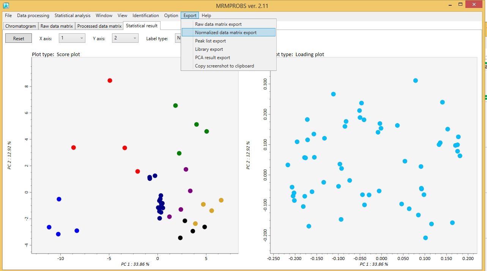  

## 付録A
## 島津の.lcdファイルの適切なファイル変換方法  
LC-QqQ/MS（MRM）分析の後に.lcdファイルの内容を変更できますが、MRMPROBSソフトウェアのファイル変換を成功させるには、適切なメソッドファイル（.lcm形式ファイル）を作成することが非常に役立ちます。  

1\. イベント名とチャンネル（MRMトランジション）ルール  

  

2\. 化合物テーブルのアップデート  
MRMトランジションのメソッド構築後、MRMイベントによって化合物テーブルの *m/z* を更新する必要があります。更新されたメソッドファイルを使用してサンプルを分析できる場合、安定したファイル変換のために他のタスクを実行する必要はありません。  

  

更新されたテーブルは、"Method"->"Data Processing Parameters"->"Compound"で確認できます。  

  

3\. データ（.lcd）が上記の適切な方法で収集されなかった場合、上記の方法で変更されたメソッドファイルを使用して.lcdファイルを改善できます。更新されたメソッドファイルの構築後、LabSolutionsの"Postrun Analysis"を開いてください。  

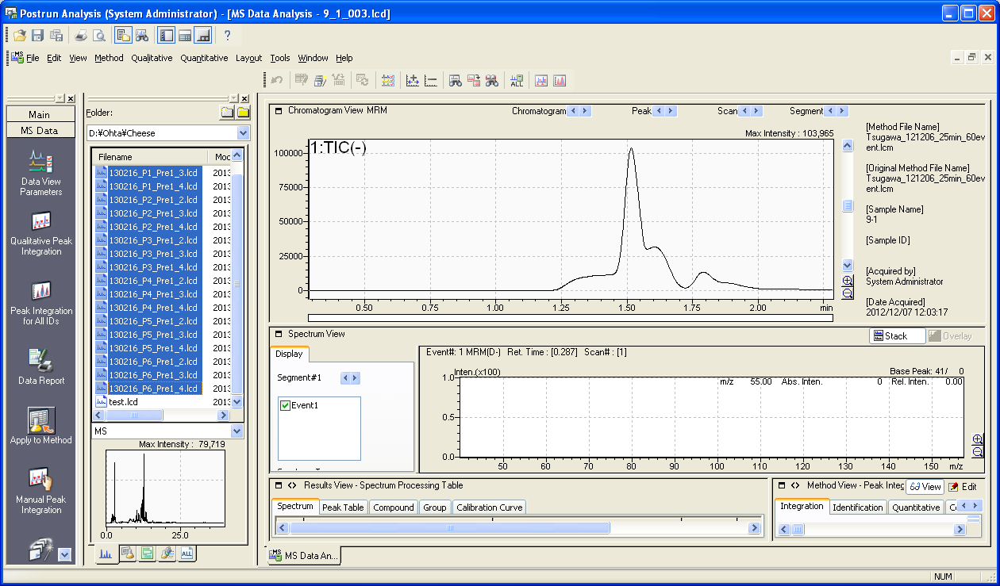   

解析ファイル(.lcd)を選択した後、"Apply to Method"ボタンを押して下さい。  

   

変更したメソッドファイルを選択し、複合テーブル *m/z* を含む.lcdファイルを改善します。これを行えたら、ファイル（.lcd）はReifycs Inc.ソフトウェアによって正常に変換されます。  

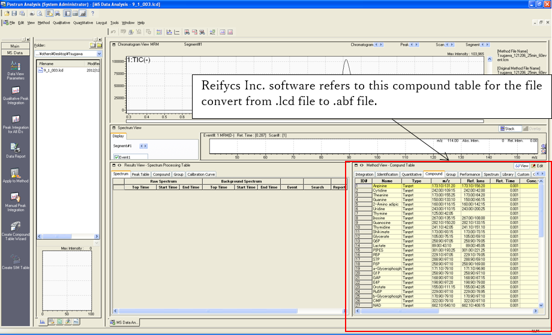   

4\. ファイル変換  
条件: LabSolutionsソフトウェアをインストールすることにより、.lcdファイルから.abfファイルに変換できます。ファイル変換には、LabSolutions ver. 5.53 SP4以降の"TTFLDataExportVer5.dll"が必要です。"TTFLDataExportVer5.dll"（Program Files (or &#042;86)>LabSolutions）のプロパティを確認して下さい。ファイルサイズが577,536バイト未満の場合は、島津製作所に連絡してファイルの変更を依頼してください。  
"AnalysisBaseFileConverter.exe"を開いた後、.lcdファイルをこのコンバーターにドラッグ＆ドロップして下さい。  

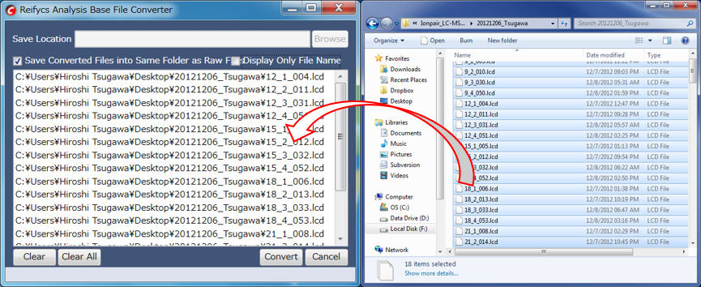   

"Convert"ボタンを押して下さい。ABFフォーマットのファイルが、.lcdファイルのある同じフォルダに生成されます。  

## 付録B
## MRMPROBSの３番目のオプション: mzMLファイルの解析  

**必要なソフトウェアとファイル**  
* MSConvert  
ダウンロードリンク: <http://proteowizard.sourceforge.net/>  
* MRMPROBS  
ダウンロードリンク: <http://prime.psc.riken.jp/Metabolomics_Software/MRMPROBS/index.html>  
* 化合物同定のためのリファレンスファイル(タブ区切りのテキストファイル)  

MRMPROBSは、mzML形式のファイルをインポートできます。MRMPROBSの3番目のオプションでは、"function id"を使用してクロマトグラムデータを抽出します。 ユーザーは、通常のライブラリ形式に加えて、リファレンスライブラリに"function id"情報を追加する必要があります。   

**ProteoWizardのダウンロード**  
1. ダウンロードタイプの選択: Windowsインストーラー（ベンダーリーダーサポートを含む）をお勧めします  
2. 利用許諾契約を読んで、proteowizardをダウンロードします  

   

(<http://proteowizard.sourceforge.net/downloads.shtml>)  

**ProteoWizardのセットアップ**  
1. ウィザードウィンドウに従います  
2. "SeeMS"もインポートします  

**ProteoWizardでのベンダーのMSファイルからmzMLへの変換**  
1. MSConvertGUI.exeを実行  
2. "List of Files"を選択  
3. "Browse"ボタンよりベンダーのファイルを選択  
4. "Options"で、"Use numpress linear compression"、"Use numpress short logged float compression"、"Use numpress short positive integer compression"はチェックしないでください。"binary encoding precision"はどちらも利用可能です。  
5. "Start"ボタンをクリックして下さい  

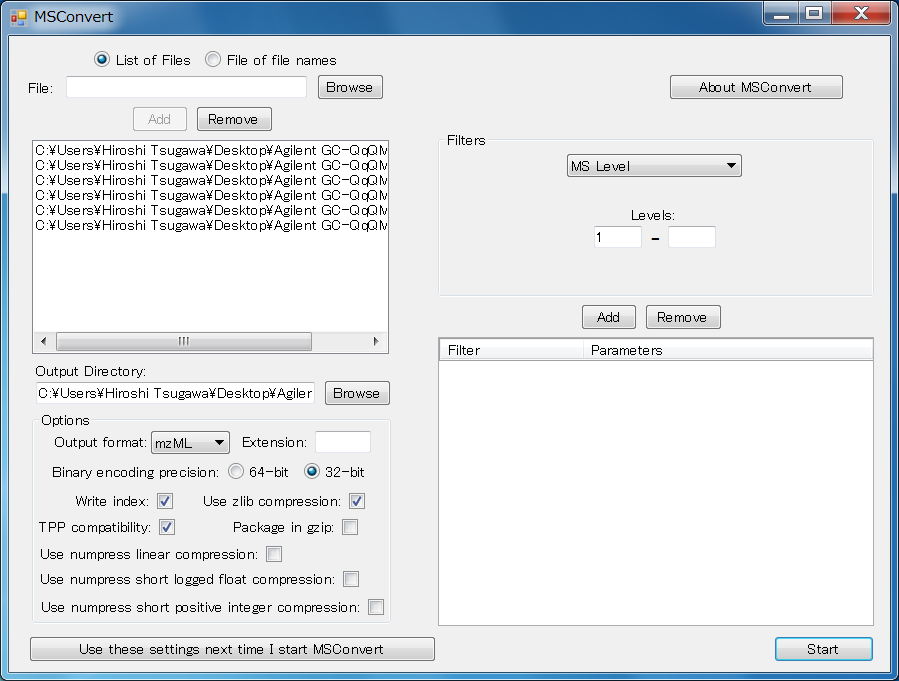   

注意! ProteoWizardは島津のMSフォーマットはサポートしていません。島津のMSフォーマットを使用したい場合は、abfコンバーターを使って下さい。  
