# MS-FINDER　チュートリアル  

Last edited in Dec. 6, 2018  

## はじめに  
メタボロミクスの目的は、生体内の小さな分子の「包括的な」分析を実行することです。 電子イオン化質量分析計と組み合わせたガスクロマトグラフィー（GC/MS）およびエレクトロスプレーイオン化（ESI-）タンデム質量分析計と組み合わせた液体クロマトグラフィー（LC/MS/MS）は、ノンターゲットメタボロミクスに適したツールです。 現在、標準物質のEI-MSおよびMS/MSデータが限定されていることがネックとなり、GC/MSおよびLC/MS/MSベースのノンターゲット解析の主な問題は、化合物の同定となっています。   
&emsp;&emsp;&emsp;&emsp;MS-FINDERは、EI-MS（GC/MS）およびMS/MSのスペクトルマイニングをサポートする化合物のアノテーションを行うユニバーサルなプログラムとして開発されました。 まず、MS-FINDERは、1）組成式の予測、2）フラグメントのアノテーション、3）未知のスペクトルを用いた構造解明行うことを目的としています。 さらに、このプログラムでは、MassBank、LipidBlast、GNPSなどのスペクトルの公開データベースを使用して、未知のスペクトルにアノテーションを付けることができます。 MS-FINDERは、JST/NSF SICORPの「低炭素社会のためのメタボロミクス」プロジェクトからサポートを受け、有田正規教授（理化学研究所）とOliver Fiehn教授（UC Davis）の共同研究として開発されました。  

津川裕司　 
理化学研究所　環境資源科学研究センター 
hiroshi.tsugawa@riken.jp  

 

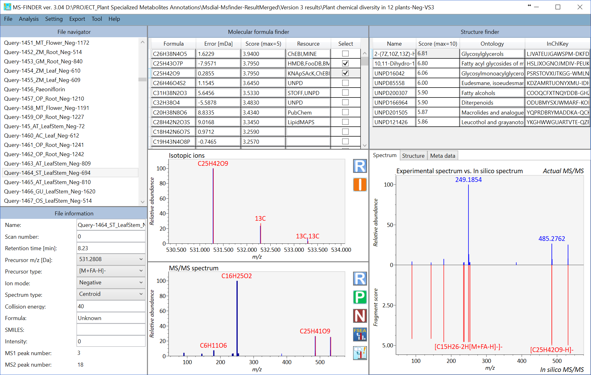
MS-FINDER スクリーンショット  
 

<h1 id="ms-finder-tutorial">MS-FINDER tutorial</h1>
<h2 id="table-of-contents">Table of contents</h2>

<a href="#セクション1">セクション1: ソフトウェアの使用環境</a> 
<a href="#セクション2">セクション2: 必要なプログラム</a> 
<a href="#セクション3">セクション3: ASCIIフォーマットの条件</a> 
&emsp;<a href="#セクション3-1">セクション3-1: MSPフォーマット：MS/MS</a> 
&emsp;<a href="#セクション3-2">セクション3-2: MSPフォーマット：EI-MS</a> 
&emsp;<a href="#セクション3-3">セクション3-3: MATフォーマット</a> 
&emsp;<a href="#セクション3-4">セクション3-4: アダクトイオンのフォーマット: [M+Na]+, [M+2H]2+, [M-2H2O+H]+, [2M+FA-H]-, etc.</a> 
&emsp;<a href="#セクション3-5">セクション3-5: ユーザーの用意するデータベースのフォーマット</a> 
&emsp;<a href="#セクション3-6">セクション3-6: 組成式の元素数を決定するのに必要なフィールド</a> 
<a href="#セクション4">セクション4: クエリ―のインポート</a> 
&emsp;<a href="#セクション4-1">セクション4-1: MSPまたはMAT形式のファイルを含むフォルダからのインポート</a> 
&emsp;<a href="#セクション4-2">セクション4-2: MS-FINDERプログラムのグラフィカルユーザーインターフェイスからのインポート</a> 
&emsp;<a href="#セクション4-3">セクション4-3: MS-DIALプログラムからのインポート</a> 
<a href="#セクション5">セクション5: パラメーターの設定</a> 
&emsp;<a href="#セクション5-1">セクション5-1: Method tab</a> 
&emsp;<a href="#セクション5-2">セクション5-2: Mass spectrumタブ</a> 
&emsp;<a href="#セクション5-3">セクション5-3: Formula finderタブ</a> 
&emsp;<a href="#セクション5-4">セクション5-4: Structure finderタブ</a> 
&emsp;<a href="#セクション5-5">セクション5-5: Data sourceタブ</a> 
<a href="#セクション6">セクション6: <em>in silico</em>フラグメンターによる化合物のアノテーション</a> 
<a href="#セクション7">セクション7: スペクトルデータベースの検索に基づく化合物のアノテーション</a> 
<a href="#セクション8">セクション8: FSEA (fragment set enrichment analysis)</a> 
<a href="#セクション9">セクション9: 化合物のアノテーション（バッチ解析）</a> 
<a href="#セクション10">セクション10: Peak assignment (single)</a> 
<a href="#セクション11">セクション11: Peak assignment（バッチ解析）</a> 
<a href="#セクション12">セクション12: Molecular spectrum networking</a> 
<a href="#セクション13">セクション13: マウスの機能</a> 
<a href="#セクション14">セクション14: 出力</a> 
<a href="#セクション15">セクション15: ヘルプ</a>

   
## セクション1
## ソフトウェアの使用環境  
* Windows OS (.NET Framework 4.5 or later): Windows 7 or later  
* RAM: 8.0 GB or more  

   
## セクション2
## 必要なプログラム  
* MS-FINDER  
ダウンロードのリンク: <http://prime.psc.riken.jp/Metabolomics_Software/MS-FINDER/index.html>  

* MS-FINDERは、Windows PCのローカルソフトウェアプログラムとして使用できます。このプログラムは、MSP（EI-MSおよびMS/MS）または改良されたMSP（MSおよびMS/MS、ファイル拡張子はMATでなければなりません）を含むASCII形式のファイルをインポートできます。さらにユーザーは、MS-FINDERグラフィカルユーザーインターフェイスでクエリを直接作成できます。さらに、このプログラムは、MS-DIALプログラムから呼び出すことができます。MS-DIALは以下のサイトからダウンロードできます： <http://prime.psc.riken.jp/Metabolomics_Software/MS-DIAL/index.html>。  

   
## セクション3
## ASCIIフォーマットの条件  
このプログラムは、以下で説明する条件でフォーマットされた2つのファイル拡張子（MSPまたはMAP）のファイルを使用できます。 不明なクエリは、ASCIIファイルに個別に保存する必要があります。MSPまたはMAPファイルは、複数の化合物のレコードを単一のファイルとして保存することは**できません**。   

MSPのフォーマットは，基本的には"NIST MS search"のマニュアルに従っています.   
リンク: <http://www.nist.gov/srd/upload/NIST1a11Ver2-0Man.pdf>  

   
### セクション3-1
### MSPフォーマット：MS/MS  
必要な項目  
* NAME:  
* PRECURSORMZ:  
* PRECURSORTYPE:  
* IONMODE: (Positive or Negative)  
* Num Peaks:  
* *m/z* intensity pair (区切り文字として、タブ、コンマ、スペースを使用することができます)  
 

* 質量スペクトルはMS/MSとしてインポートします  
* 既知の組成式を使ってMS/MSピークのアノテーションを実行したい場合は、"FORMULA"と"SMILES"も含めて下さい。ただし、ニュートライズされた組成式の"FORMULA"と"SMILES"を準備してください。  

MSPの例  
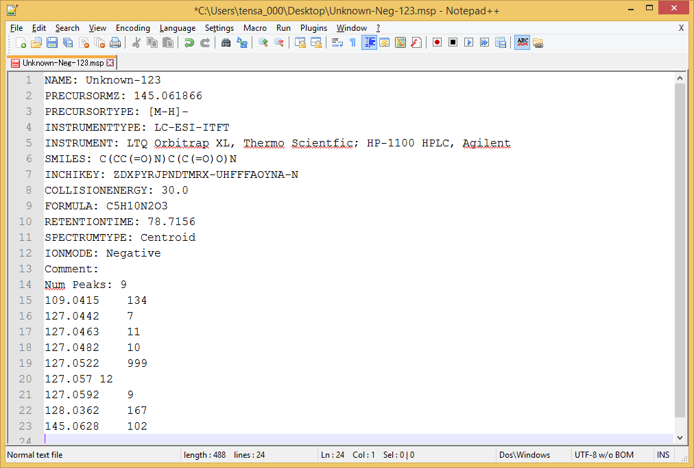
   
### セクション3-2
### MSPフォーマット：EI-MS  
必要な項目  
* NAME:  
* IONMODE: (Positive or Negative)  
* Num Peaks:  
* *m/z* intensity pair (区切り文字として、タブ、コンマ、スペースを使用することができます)

これらの項目は、スペクトルのデータベースを検索するための最小要件です。Ei-MSデータで組成式の予測と、構造の解明を実行するためには、"PRECURSORMZ:"と"PRECURSORTYPE:"が必要です。   

   
### セクション3-3
### MATフォーマット  
MAT形式は、MS-FIDNERプログラムでMSPの改良版として定義され、MS1とMS/MSの両方のスペクトルを同じファイルに保存することができます。組成式予測のための"isotopic ion score"を計算するには、MSデータのサーベイスキャンが必要です。重要なのは、EI-MSスペクトルの場合、同位体比とフラグメントイオンの類似性を計算するために、MS1とMS2の両方の項目にスペクトルを置くことです。  

必要な項目  
* NAME:  
* PRECURSORMZ:  
* PRECURSORTYPE:  
* IONMODE:  
* **MSTYPE:**  
* Num Peaks:  
* *m/z* intensity pair (区切り文字として、タブ、コンマ、スペースを使用することができます)  

&#10003; MSTYPE、Num Peaks、 *m/z* intensity pairの３つの項目は、連番で保存して下さい。

&#10003; "MSTYPE：MS1"と入力すると、次の項目から書き込まれたスペクトルはサーベイスキャンMS（MS1）として認識されます。"MSTYPE：MS2"と入力すると、次に書き込まれるスペクトルはMS/MSスペクトルとして認識されます。

&#10003; MS-FINDERでは、EI-MSスペクトルはMS1とMS2の両方について保存する必要があります。  

&#10003; "MSTYPE：MS1"および"MSTYPE：MS2"は、必須ではありません。ASCIIファイルは、MS1スペクトルのみ、またはMS/MSスペクトルのみのレコードとしてインポートできます。   

&#10003; スペクトルのレコードなしでも、MATまたはMSPファイルを準備できます。この場合、組成式の予測は、質量確度とデータベースをもとにして実行されます。  

&#10003; 既知の構造でMS/MSピークのアノテーションを実行する場合は、"FORMULA"と"SMILES"も含めて下さい。ただし、ニュートライズされた組成式の"FORMULA"と"SMILES"を準備してください。  

   
MAT example  
  

### セクション3-4   
### アダクトイオンのフォーマット: [M+Na]+, [M+2H]2+, [M-2H2O+H]+, [2M+FA-H]-, etc.  
1. 括弧"["および"]"を使用して、イオン情報を囲みます。  
2. "]"の後に"+"と"-"が必要で、数字は"+"または"-"の前に書き込んでください。  
3. C6H12O5のような有機化合物の組成式を定義する場合、要素の重複や括弧を用いずに記述する必要があります。 たとえば、[M+C2H5COOH-H]-や[M+H+(CH3)3SiOH]+などは、受け入れられません。  
4. "2H2O"のような組成式の最初の数字は、"H2O×2"として認識されます。"2(H2O)"とはしないでください。  
5. 連続式は許容されます: [2M+H-C6H12O5+Na]2+  
6. ラジカルイオンは、"[M]+."のように"+"または"–"の後に"."（ドット）として記述できます。アダクトイオンのフォーマットでは、例えば"[M-CH3]+."となります。  
7. MS-FINDERは、以下のような略語や一般的な有機化合物の組成式を付加イオンのタイプとして使用できます。  
アセトニトリル: ACN, CH3CN  
メタノール: CH3OH  
イソプロパノール: IsoProp, C3H7OH  
ジメチルスルホキシド: DMSO  
ギ酸: FA, HCOOH  
酢酸: Hac, CH3COOH  
トリフルオロ酢酸: TFA, CFCOOH  

   
### セクション3-5   
### ユーザーの用意するデータベースのフォーマット  

MS-FINDERは、ユーザーが提供するデータベースを用いた解析をサポートしています。下図のような形式のファイルを、タブ区切りテキストファイルとして準備する必要があります。"InChIKey"、"short InChIKey"、および"database ID"の項目は必須ではありませんが、ダミーの値を入力しておく必要があります。正しく"InChIKey"を設定すると、データベースからのスコアリングが組成式のランキングにも使用されます。"exact mass"、"formula"、および"SMILES"は、正確に準備する必要があります。

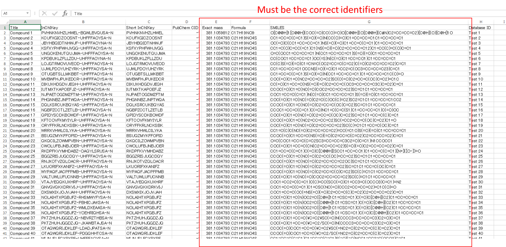  
   
### セクション3-6   
### 組成式の元素数を決定するのに必要なフィールド  
MS-FINDERは、組成式予測のフィルタリングのための項目を新たに設けました。たとえば、完全にラベル付けされた安定同位体実験を実行できる場合、CHNOSの５つの元素の数は、ラベル付けされていないサンプルデータとラベル付けされたサンプルデータ間の質量の違いをチェックすることによって決定できます。下図で説明している項目は、MSPおよびMATファイルに書き込むことができます。  

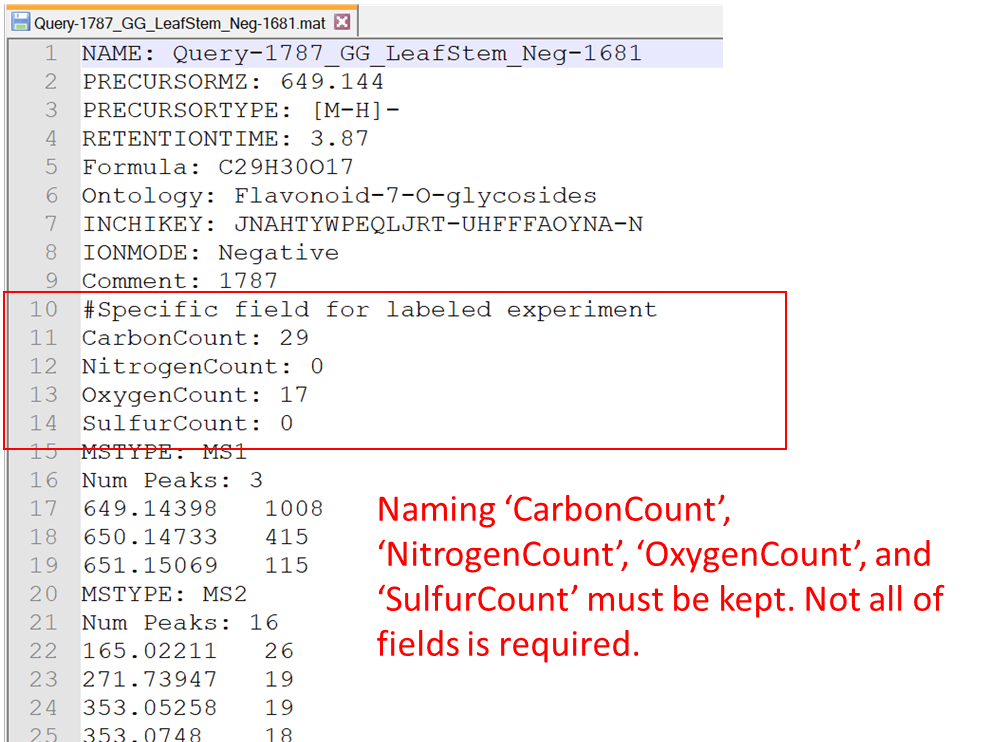  
   
## セクション4
## クエリ―のインポート  
未知のクエリーをインポートする方法は３つあります。   

### セクション4-1
### MSPまたはMAT形式のファイルを含むフォルダからのインポート  
1. File -> import  
2. MSPまたはMAT形式のファイルを含むフォルダを選択してください  

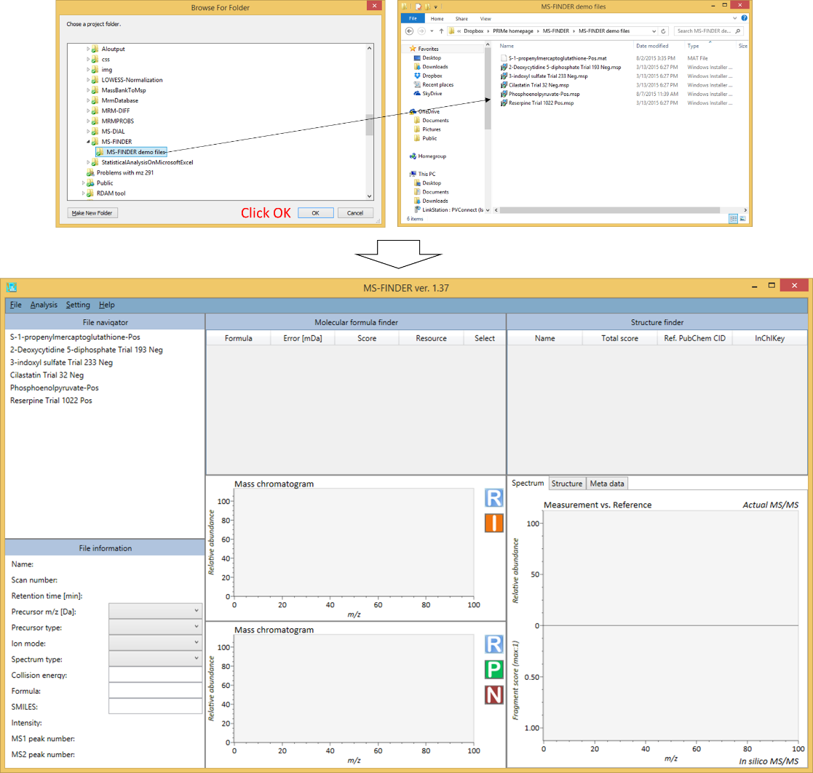  

   
### セクション4-2
### MS-FINDERプログラムのグラフィカルユーザーインターフェイスからのインポート  
1. File -> Create a query  
2. フォームに入力してクエリを作成します  

必須項目  
* Folder path  
* File name  
* Precursor *m/z*  

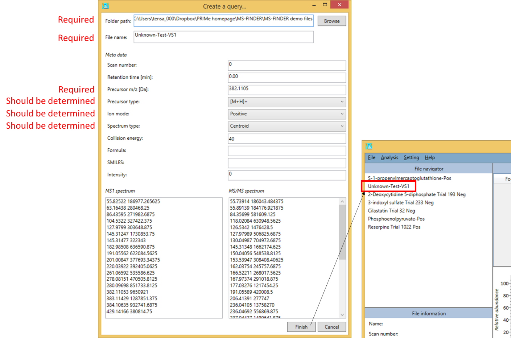  
   
### セクション4-3
### MS-DIALプログラムからのインポート  
LC/MS/MSのデータ処理用ソフトウェアであるMS-DIALプログラムから、MS-FINDERプログラムを直接呼び出すことができます。MS-DIALでMS-FINDERプログラムを初めて呼び出すときは、MS-FINDERのファイルパスを選択してください。  

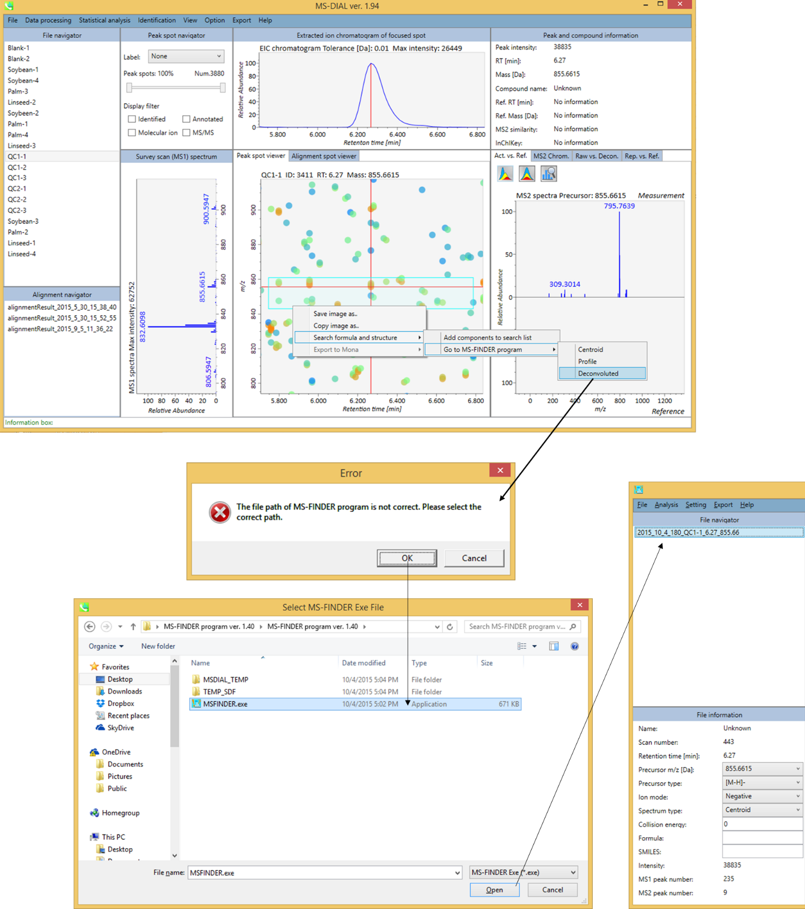  
 

## セクション5
## パラメーターの設定  
### セクション5-1
### Methodタブ  

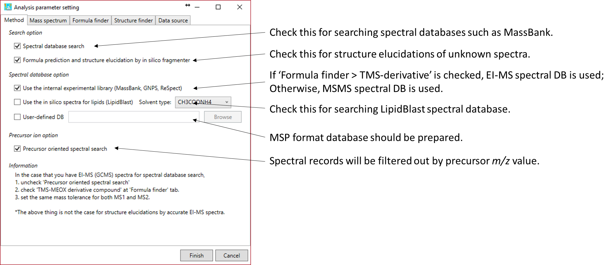

MS-FINDERでの化合物のアノテーションには、2つのオプションがあります。1つはスペクトルのデータベースに基づくもので、もう1つはin silicoフラグメンターを使用した組成式および構造検索プログラムに基づくものです。"spectral database search"と"formula prediction and structure elucidation by in silico fragmenter"オプションの両方を同時にチェックでき、"spectral database search"の結果が構造のランキングに優先されます。  
&emsp;&emsp;&emsp;&emsp;"internal experimental library"は、NIST MSP形式としてResourcesフォルダーの"EIMS-DBs-vs&#042;.egm"および"MSMS-DBs-vs&#042;.etm"に保存されています。もし、 "Formula finder > TMS-MeOX derivative compound"をオンにすると、EIMSデータベースが使用されます。それ以外の場合は、MSMSデータベースが使用されます。"in silico spectra for lipids (LipidBlast)"は、Resourcesフォルダの"MSDIAL-LipidDBs-vs&#042;.lbm"に保存されています。未知のクエリーを検索するための適切な溶媒条件を選択します。 ユーザー定義のスペクトルデータベースは、NIST MSPのフォーマットである必要があります。  
&emsp;&emsp;&emsp;&emsp;"Precursor oriented spectral search"がチェックされいてる場合は、 組成式の候補は、MS1許容値とスペクトルの前駆体 *m/z* によって絞り込まれます。 それ以外の場合は、すべてのスペクトルレコードが候補となります。 EIスペクトルデータベースで検索する場合は、このオプションをオフにします。  
   
### セクション5-2
### Mass spectrumタブ  

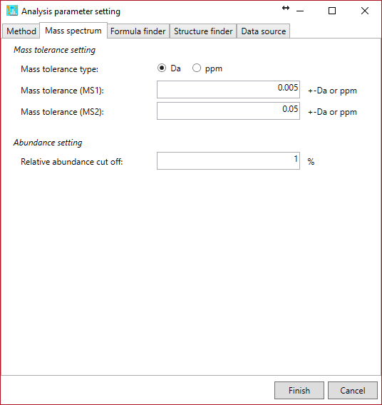

*Mass tolerance (MS1):* 組成式の候補を絞り込むための質量許容値  

*Mass tolerance (MS/MS):* クエリーとリファレンスのスペクトルをマッチングさせるための質量の許容値  

*Relative abundance cut off:* ベースとなるピークイオンに基づくこのパラメーターよりも大きいプロダクトイオンが，マッチングに使用されます。   

&#042; EI-MSスペクトルの場合、MS1とMS2には同じ許容値を設定して下さい。  

   
### セクション5-3
### Formula finderタブ  
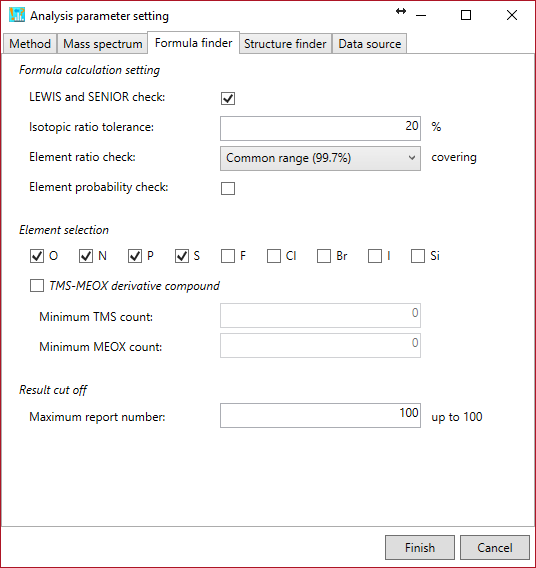  

*Formula calculation setting:* 組成式の計算に必要なパラメーターを設定できます   

*LEWIS and SENIOR check:* 組成式を構成する元素の原子価規則に一致する候補式を生成します。ヘテロ原子の原子価、つまりN、O、S、およびPは、現在それぞれ3、2、6、および5に設定されています。   

*Isotopic ratio tolerance:* 同位体スコアを計算します。MS-FINDERの論文で説明されているように、許容値はガウススコアリングのシグマ値として利用されます。   

*Element ratio check:* MS-FINDERの論文で説明されているように、すべての元素比（例："Common range (99.7%)"制限の場合、H/C比は0〜3.33の範囲になります）を満たす組成式の候補を生成します。   

*Element probability check:* "Seven Golden Rules"を提唱した論文で説明されているヒューリスティックルールを満たす組成式の候補を生成します。たとえば、組成式の候補に"NOPS all > 1"が含まれている場合、N、O、P、Sの元素数はそれぞれ9、19、3、2未満となるはずです。   

*Element selection:* to generate formula candidates that just contain the elements selected by the users. Check ‘TMS-MEOX derivative compound’ if you want to annotate EI-MS spectra.  

*Result cut off:* MS-FINDERプログラムによってランク付けされた組成式のうち、出力する候補数の上限を設定して下さい。  
 

### セクション5-4
### Structure finderタブ  

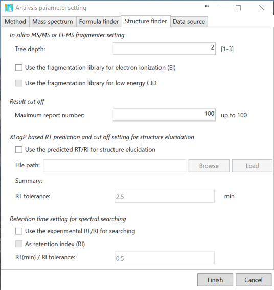  

"in silico fragmenter"のパラメーター設定は次のとおりです。   

*Tree depth:* in silicoの開裂の場所の数を設定します。例えば"2"と設定すると、MS-FINDERプログラムはプロダクトイオンのプロダクトイオンまでフラグメントを生成します。  

現在のMS-FINDERプログラムでは、EI-MSスペクトルのマイニングに"&#042;.eif"で保存されているフラグメントイオン・ライブラリを使用することができます。（使用を推奨）   

*Result cut off:* MS-FINDERプログラムによってランク付けされた構造のうち、出力する候補数の上限を設定して下さい。  

*XLogP based RT prediction and cut off setting for structure elucidation*  
CDKによって計算されたXLogPを使用した単純なRT予測機能を新しく加えています。下図のように、（最初の列）代謝物名、（2列目）保持時間（分）、（3列目）SMILESコードを含むタブ区切りテキスト形式ファイルを準備すると、構造候補を検索するために予測保持時間が計算されます。  

*Retention time setting for spectral searching*  
この機能はスペクトル検索用です。MSPまたはMATファイルに保持時間（RT）または保持インデックス（RI）情報が含まれている場合、このチェックボックスを使用してRTまたはRIのよるフィルタリングを実行できます。   

  
   
### セクション5-5
### Data sourceタブ  
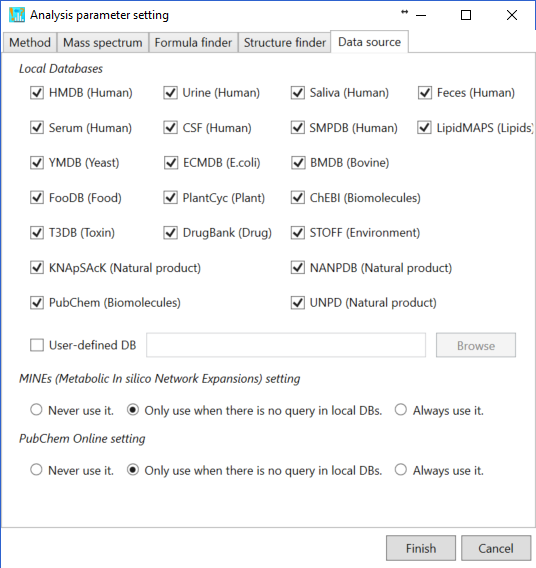  

*Local databases:* "&#042;.esd"として保存されている14のメタボロームデータベースが新たにMS-FINDERプログラムで提供されています。ユーザーが選択したローカルデータベースは、構造データの取得に使用されます。ユーザー独自の構造候補の検索については、セクション3-5をご覧ください。

*MINEs (Metabolic In silico Network Expansions) and PubChem online settings:*  
* ユーザーが"Never use it"を選択した場合、構造候補はローカルデータベースからのみ選択されます。   
* "only use when there is no query in the below DBs"を選択すると、ローカルデータベースに構造が見つからない場合、MINEおよびPubChem複合データベースの構造データが取得されます。   
* "always use it"が選択されると、MS-FINDERプログラムは常に、ローカルデータベースに加えて、MINEおよびPubChemデータベースから構造データを取得します。   

 

## セクション6
## *in silico* フラグメンターによる化合物のアノテーション  

ここでは、MS-FINDERの一般的なワークフローについて説明します。（バッチ解析を以下に示します）  

1\. 組成式の予測は、"File navigator"のタイトル名をダブルクリックすると実行されます。組成式の計算の詳細については、我々の論文で説明しています。  
&#042; 組成式予測のポイントは、プリカーサータイプ（アダクトイオン）を正しく選択し、正しい組成式が選ばれるように正しくパラメーターを設定することです。   

  

* "Select"列でチェックされた組成式候補は、構造検索プログラムで解析されることになっています。  
* 同位体イオンは、質量スペクトルの上部ウィンドウの"I"ボタンで表示されます。  
* プロダクトイオンでの組成式の割り当ての結果は、下部のスペクトルウィンドウの"P"ボタンで表示されます。  
* ニュートラルロスのアノテーションの結果は、下部ウィンドウの"N"ボタンで表示されます。  

2\. 構造検索プログラムは、組成式の結果表を右クリックし、"Search the structure"をクリックすると実行されます。  

  

* "Select"列でチェックされた組成式候補は、構造検索プログラムで解析されることになっています。  
* 構造ファインダーの合計スコアは、組成式スコアと構造スコアの合計値とないます。したがって、組成式のスコアが他の組成式のスコアよりも大きい場合でも、別の組成式候補からの構造が、構造検索プログラムの最上位の候補になることがあります。   
* MS-FINDERプログラムは、同じ分子骨格を持つ構造をInChIKey（最初の14文字）で統合します。構造の代表は、PubChemリポジトリの同義語の数によって決まります。   
   

## セクション7
## スペクトルデータベースの検索に基づく化合物のアノテーション  
とても簡単です。アノテーションを付けたい未知のレコードをダブルクリックします。下図は、EI-MSスペクトルデータベースとLipidBlastデータベースで検索する例です。  
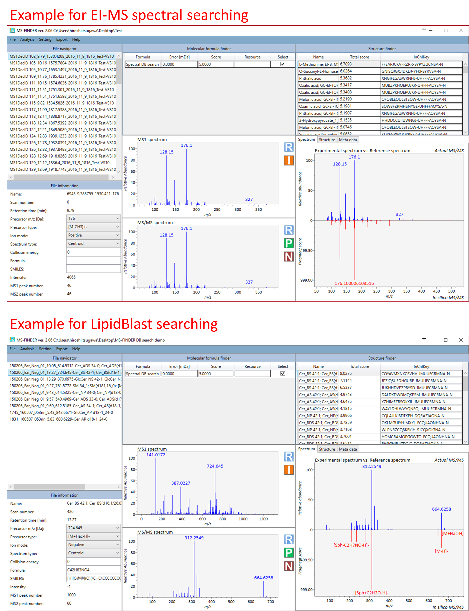  

   
## セクション8
## FSEA (fragment set enrichment analysis)  
この機能は、未知のMS/MSスペクトルの代謝物クラスを推定します。代謝物クラスへの分類は、組成式予測のプロセスの中で実行されます。したがって、組成式候補が出力されると、その結果も確認できます。FSEAの結果を確認するには（たとえば、下図で示すC20H18O10の場合）、"Molecular formula finder"の結果の行がアクティブになった後に、FSEAボタンをクリックしてください。この化合物の正しい構造はケンペロール-3-O-アラビノシドであるため、推定された代謝物クラスのうち2番目のヒット、つまりフラボノールO-グリコシドがこのクエリの正しい代謝物クラスとなります。これが、代謝物クラス推定の現在の精度です。推定されたp値の情報とともにいくつかの候補が提案されます。 p値の推定は、3つのdecoy基準によって計算できます。  

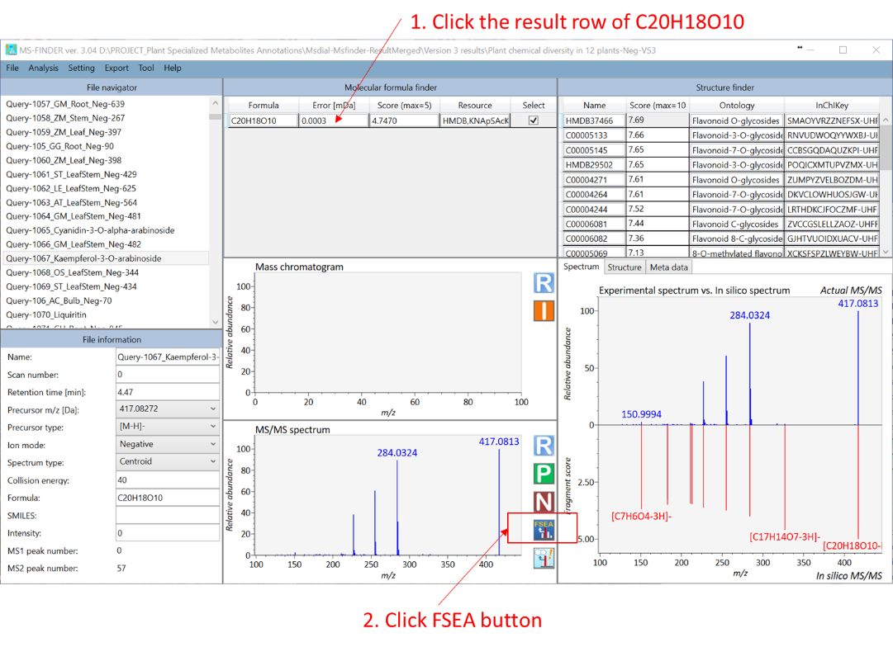  

  

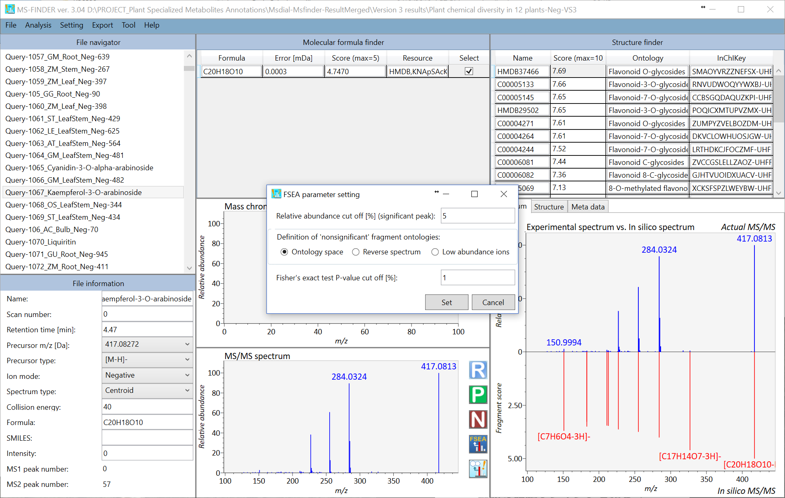  

代謝物クラスの推定にover-representation analysis（ORA）を使用する際の難しい問題は、MS/MSスペクトルセットの**重要ではない**ピークを決定する方法です。現在、重要でないピークを定義する3つのオプションがあります。"Setting -> FSEA parameter setting"で設定を変更できます。"relative abundance cut off"が5％で"Low abundance ions"を選択すると、相対存在量が5％未満のイオンは**重要でない***ピークとして認識されます。FSEAの結果を下図に示します。推定p値が1％未満の29の代謝物クラスが出力されています。    

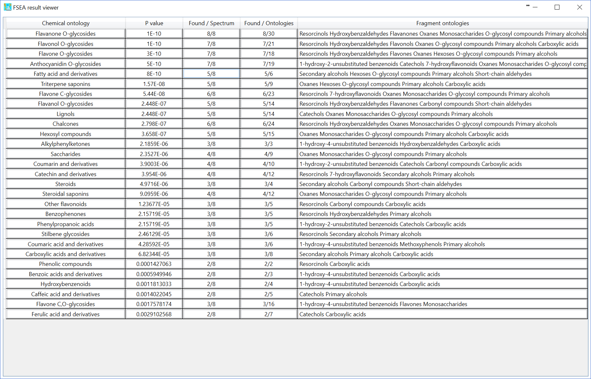  

さらに、"reverse spectrum"を選択した場合、逆スペクトルの**重要な**ピークはすべて**重要でない**ピークとして定義されます。逆スペクトルは、*m/z* の名目上の位置を5マスシフトさせてミラーリングすることにより作成されます。 たとえば、*m/z* シーケンス[101.023、305.035、421.098、634.201、754.235]は[106.023、226.035、439.098、555.201、759.235]に変更されます。FSEAの結果を下図に示します。4つのクラスが1％のp値カットオフで出力されています。  

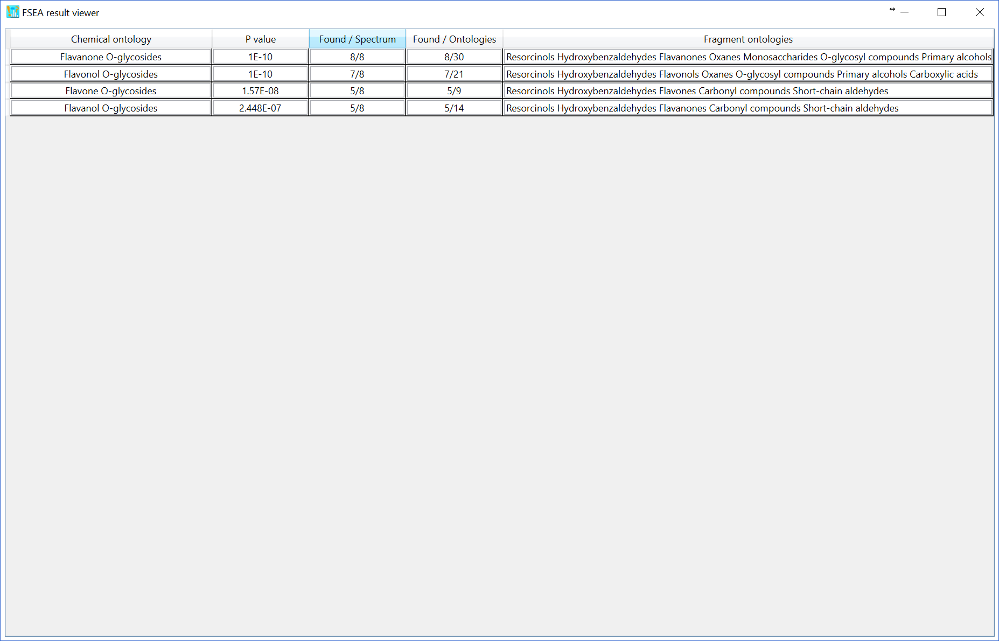  

3番目のオプション（デフォルト）として、FSEAセット（n = 459）で検出されないオントロジー、つまりフラグメントオントロジーの現在の知識空間によって、重要でないピークが自動的に計算されます。 FSEAの結果を下図に示します。29の候補が出力されています。   
&emsp;&emsp;&emsp;&emsp;一般に、"reverse spectrum"オプションが、代謝物クラス推定の偽陽性を減らす最も保守的な方法ですが、このオプションでは偽陰性が増加します。代謝クラス推定の精度を向上させるために、近い将来にプログラムはアップデートされる予定です。   

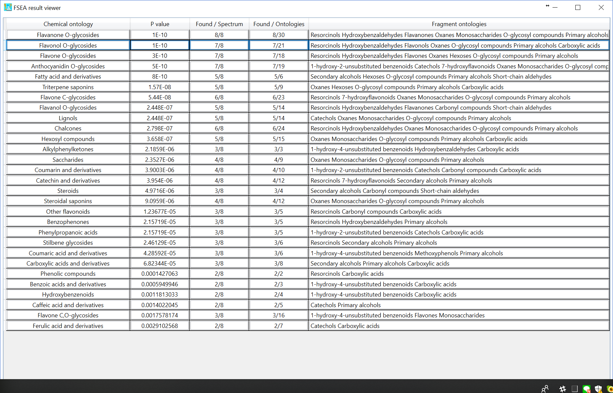  

   
## セクション9
## 化合物のアノテーション（バッチ解析）  
1\. Analysis -> Compound annotation (batch job)  

A) 組成式予測と構造解明の両方に対してバッチ解析を実行する場合は、"Both processes"にチェックを入れてください。また、組成式検索プログラムで生成される組成式候補の数を"Top N hits"テキストボックスに設定して下さい。  

  

B) 組成式予測のバッチ解析を実行する場合は、"molecular formula finder"にチェックを入れるだけで良いです。  

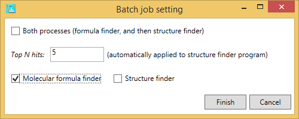  

C) 構造検索プログラムを実行する場合は、"structure finder"にチェックを入れるだけで良いです。ここでは、ユーザーがチェックした組成式候補が調べられることになっています。また、この分析の前に組成式検索プログラムが実行されない場合、クエリはパスされます。   

  
   
## セクション10
## Peak assignment (single)  
MS-FINDERプログラムは、ユーザー定義の構造からMS/MSスペクトルの構造を割り当てるピーク割り当てツールとして使用できます。  

1. Analysis -> Peak assignment (single)  
2. 解析したいクエリファイルを選択します。  
3. 組成式とSMILESの両方を、ニュートライズされたフォームとしてテキストボックスに追加します。  
4. 結果は下図のように出力されます。  

  
   
## セクション11
## Peak assignment（バッチ解析）  
Analysis-> Peak assignment (batch job)  

* このプログラムを使用するには、MSPまたはMATファイルの項目に、それぞれ"FORMULA"および"SMILES"が含まれていることを確認してください。項目を持たないレコードに対しては、プログラムは実行されません。"SMILES"または"FORMULA"は、MS-FINDER GUIの"File information"テキストボックスで追加できます（下図参照）。  

  

   
## セクション12
## Molecular spectrum networking  
MS/MSの類似性、オントロジーの類似性、および組成式に基づいたバイオリアクションプログラムを使用した統合ネットワーク手法を実行できます。この機能を十分に使用するための要件は、   
1. 同じ分析条件で取得したクエリをインポートします。  
2. "Analysis -> Compound annotation (batch job)"からバッチ解析を実行します。  
3. "Resource"フォルダ -> "Biotransformation-VS1.fbt"でbiotransformation ruleを変更できます（このファイルは、notepad ++などのテキストエディタで開くことができます）。  

ネットワーク分析を実行するには、"Analysis -> Molecular spectrum networking"に従ってください。各クエリは、MS/MSの類似性（赤）、オントロジーの類似性（青）、および組成式指向のバイオリアクション（黄色）を使用して他のクエリとリンクされています。上位ヒットの結果は、ネットワーク分析に使用されます。cytoscape.js（ローカルブラウザで使用される）の制限により、すべてのノードとエッジがネットワークに表示されるわけではありません。すべてのノードとエッジは、"Export -> Export nodes and edges for molecular spectrum network"で、ローカルで利用可能なcytoscapeプログラムで使用できるタブ区切りファイルとして出力できます。 (<http://www.cytoscape.org/cy3.html>).  

  

  
   
## セクション13
## マウスの機能  

* マウスを右クリック（または長押し）して移動：ズームインおよびズームアウト  
* マウスを左クリック（またはホールド）して移動：選択してスクロール  
* マウスの左ダブルクリック：範囲のリセット、"file navigator"でのファイルの選択  
* マウスホイール：ズームインとズームアウト  
* 右クリック：コンテキストメニューのポップアップ  

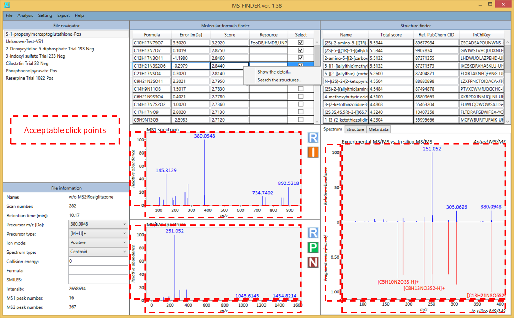  

   
## セクション14
## 出力  
組成式および構造検索の結果は、このオプションから出力できます。現在、上位10の候補が自動的に出力されます。ただし、結果の詳細をASCIIファイルとして確認することもできます。これは、MS-FINDERプログラムが、プロジェクトフォルダと同じディレクトリに組成式の結果を含むFGTファイルを生成することになっていることを意味します。また、MS-FINDERプログラムは、構造検索プログラムの結果を格納するSFDファイル（組成式の候補ごとに）を含むフォルダも生成します。   

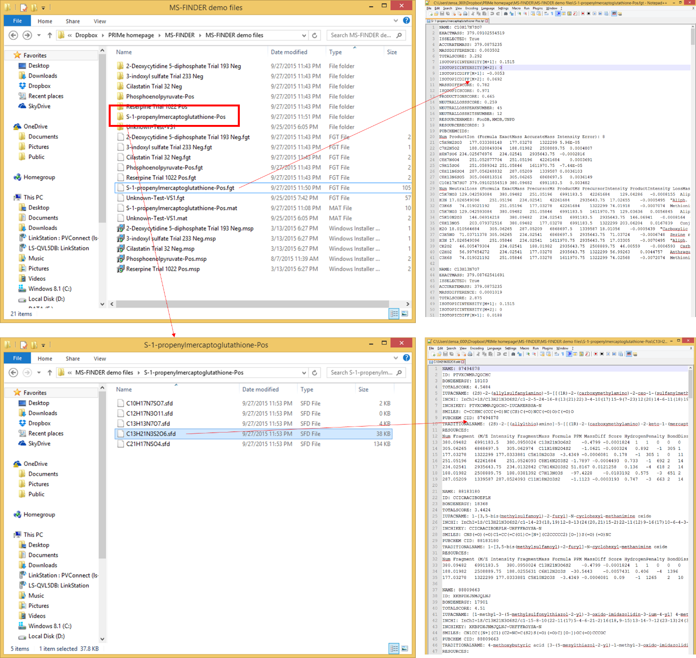  
   
## セクション15
## ヘルプ  
MS-FINDERのバージョンを確認できます。  

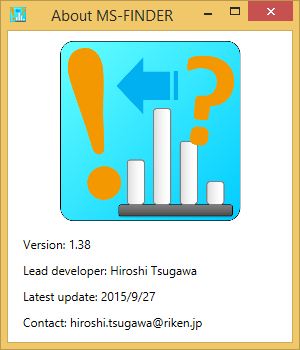  
